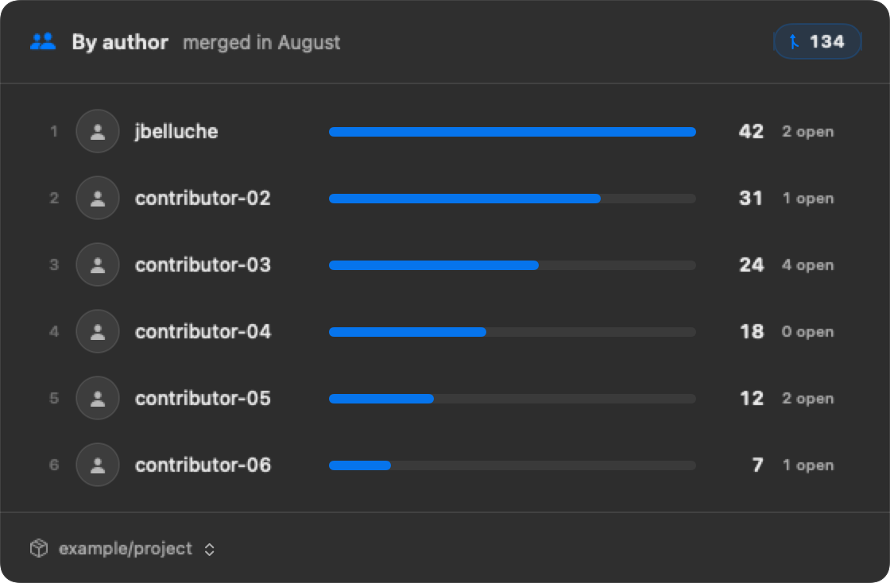

# PR Pulse

Heavily inspired from [hipsterreed](https://github.com/hipsterreed)

PR Pulse is a small native macOS menu-bar app that shows a month-to-date pull
request leaderboard for a repository you choose.



Clicking the menu-bar pulse icon opens immediately from a local cache. A GitHub
refresh starts in the background after the leaderboard is visible, so network
latency never blocks the popover. PR Pulse does not use SwiftBar.

While running, it also refreshes in the background every 30 seconds.
Right-click the menu-bar icon and choose **Quit PR Pulse** to exit.

Click the repository name in the footer to search and select from every
repository available to the authenticated GitHub CLI user. Private repository
names are loaded at runtime and are never embedded in the app or source code.

The leaderboard shows:

- contributors ordered by merged pull-request count
- GitHub avatars, relative progress bars, merged counts, and open counts
- the current month, repository, and total
- cached results when GitHub is unavailable, with a compact error message
- contributor rows linking to each author's open pull requests in the repository
- a searchable repository picker for owned, collaborator, and organization repositories

"Shipped" means authored and merged into any branch in the repository between
the first day of the current local calendar month and today. Bots and reverts
are included.

## Requirements

- macOS 14 or newer
- Swift 6.1 or newer
- [GitHub CLI](https://cli.github.com/) authenticated for the repository

```zsh
brew install gh
gh auth login -h github.com
```

## Build and run

```zsh
./Scripts/package_app.sh
open PRPulse.app
```

The package script builds a release binary, creates a menu-bar-only `.app`, and
ad-hoc signs it locally.

PR Pulse caches only the most recently viewed leaderboard data at:

```text
~/Library/Application Support/PRPulse/leaderboard.json
```

It uses the existing GitHub CLI credentials and never reads or stores a token.
The selected repository is stored locally in macOS user defaults.

## Test

```zsh
swift test
```

## Run with mock data

```zsh
./Scripts/run_demo.sh
```

This rebuilds and launches the real menu-bar app with fake contributors, PR
counts, and repositories. It closes any running PR Pulse instance first. Demo
mode does not call GitHub or read or write your selected repository, cache, or
preferences.

The default featured login is `demo-user`. To show your own public handle while
keeping every other value fictional:

```zsh
PR_PULSE_DEMO_USER=your-handle ./Scripts/run_demo.sh
```

Click the repository footer to switch between the three fake projects, then
take a normal macOS screenshot of the popover.

## Update the README screenshot

```zsh
./Scripts/generate_readme_screenshot.sh
```

The script builds and renders the real `LeaderboardView` at Retina resolution,
then writes `docs/pr-pulse-demo.png`. It asks GitHub only for your public login;
set `PR_PULSE_SCREENSHOT_USER` to override that lookup.

Screenshot mode never loads your selected repository, leaderboard cache, repo
list, or avatar URLs. It uses `example/project`, your public login, and fictional
`contributor-*` rows, so no teammate identity or private repository can leak
into the checked-in image.

## Repository access

The picker uses GitHub's authenticated-user repository API. Its contents match
the repositories the current GitHub CLI credentials can read, including private
repositories when those credentials have access.

## License

PR Pulse is available under the [MIT License](LICENSE).
